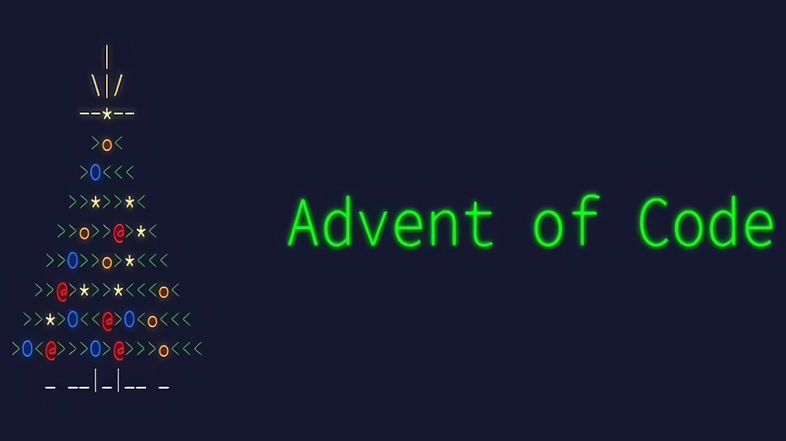

# Advent of Code

## Completion

- 2019 : 8/25 days complete in Python 3.
- 2020 : 25/25 days [COMPLETE] in Python 3.
- 2021 : 6/25 days complete in Rust 2021.

## Requirements

- Python 3 installed.
- "python3" as a recognized terminal command.

- Rust 2021 installed.
- "cargo" as a recognized terminal command.

## Directory

The years written in Python contain the following structure:

- /input/day\*.txt : Holds the inputs in text files.
- day\*.py : The code that solves both parts of the day from the input held in "/input".
- timing.py : Code that times every solution for both parts and prints the average.

The years written in Rust contain the following structure:

- /input/day\*.txt : Holds the inputs in text files.
- /src/day\*.rs : The code that solves both parts of the day from the input held in "/input".
- /src/timing.rs : Code that times every solution for both parts and prints the average.

In the top level directory:

- [WINDOWS] start.bat : Starts the "run.bat" file.
- [WINDOWS] run.bat : Runs the timing file for every year.
- [LINUX] run.sh : Runs the timing file for every year.

- template : Simple templates for the Python and Rust solutions.

## License

https://creativecommons.org/licenses/by/4.0/